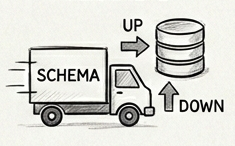

### Chapter 13 - Database Migrations



## Introduction

Your company's data is in most cases the reason that you build and maintain your apps. It's what distinguishes you from your competitors. Long ago I remember a coworker and I discussing the development of a new database structure and the web app that would be built to provide access to the data. I remember them saying something along the lines of "Let's get the database schema right before we start on the app, because the apps and the languages they're written in will come and go, but the data will persist longer than any app we create that has access to it." In my career, this statement has been true on almost every project that I've worked on. It's at the core of this guide, which is replacing one language and framework with another. Most apps, whether enterprise, social media or almost any other category, are just a means to generate and retrieve some data in a database.

Keeping your database schema in sync across all of your environments is key to software development. Ruby on Rails has a unique feature called database migrations. It versions database changes and allows you to write Ruby code that's database agnostic but converts at runtime into SQL code that runs a DDL (data definition language) command to modify the schema. Each time the migration task is run, it compares the versions of the files in the migration folder with those found in the `schema_migrations` table and only runs the code that's missing from that table, thus ensuring that it doesn't try to make the same changes twice.

## Examples

### Ruby

Rails provides an end-to-end solution with command-line options to manage your database schema. The `db` folder is where migration files are stored in a database-agnostic format.

Creating a new table.

```ruby
bin/rails generate migration CreateBenefits name:string benefit_type:integer activated_at:datetime

      invoke  active_record
      create    db/migrate/20260417073020_create_benefits.rb
```

The auto-generated migration file.

```ruby
cat db/migrate/20260417073020_create_benefits.rb
class CreateBenefits < ActiveRecord::Migration[8.1]
  def change
    create_table :benefits do |t|
      t.string :name
      t.integer :benefit_type
      t.datetime :activated_at

      t.timestamps
    end
  end
end
```

Running the migration.

```ruby
bin/rails db:migrate

== 20260417073020 CreateBenefits: migrating ===================================
-- create_table(:benefits)
   -> 0.0014s
== 20260417073020 CreateBenefits: migrated (0.0014s) ==========================
```

The contents of the schema.rb file. This file can be used to create our test database and empty databases in other environments (with the `bin/rails db:setup RAILS_ENV=test` command) vs running the migration files individually.

```ruby
cat db/schema.rb

# This file is auto-generated from the current state of the database. Instead
# of editing this file, please use the migrations feature of Active Record to
# incrementally modify your database, and then regenerate this schema definition.
#
# This file is the source Rails uses to define your schema when running `bin/rails
# db:schema:load`. When creating a new database, `bin/rails db:schema:load` tends to
# be faster and is potentially less error prone than running all of your
# migrations from scratch. Old migrations may fail to apply correctly if those
# migrations use external dependencies or application code.
#
# It's strongly recommended that you check this file into your version control system.

ActiveRecord::Schema[8.1].define(version: 2026_04_17_073020) do
  create_table "benefits", force: :cascade do |t|
    t.datetime "activated_at"
    t.integer "benefit_type"
    t.datetime "created_at", null: false
    t.string "name"
    t.datetime "updated_at", null: false
  end
end
```

### Go

Go has a few options to manage database migrations. The GORM library has options to automatically run migrations, but following this pattern in a production environment is risky, so using a library that manages database versioning is safer because you can isolate specific migrations and manage their up and down state. Let's explore one of these libraries by writing some SQL and testing its up and down features.

Golang-migrate has a command-line interface that makes it easy to run migration files against the specified database. The migration files can be written in SQL for the target database type. Let's write a few migrations and run them against a sqlite database. The file naming pattern is `<version>_<description>.{up|down}.sql`. The `up` file will be run to roll the migration forward, while the `down` file will be run when rolling back a migration.

File `migrations/0001_initialize_schema.up.sql`

```sql

CREATE TABLE IF NOT EXISTS employees (
  id INTEGER PRIMARY KEY,
  name TEXT NOT NULL,
  created_at DATETIME DEFAULT CURRENT_TIMESTAMP,
  updated_at DATETIME DEFAULT CURRENT_TIMESTAMP
);
```

File `migrations/0001_initialize_schema.down.sql`

```sql
DROP TABLE employees;
```

File `migrations/0002_add_benefits_table.up.sql`

```sql
CREATE TABLE IF NOT EXISTS benefits (
  id INTEGER PRIMARY KEY,
  name TEXT NOT NULL,
  benefit_type INTEGER,
  activated_at DATETIME,
  created_at DATETIME DEFAULT CURRENT_TIMESTAMP,
  updated_at DATETIME DEFAULT CURRENT_TIMESTAMP
);
```

File `migrations/0002_add_benefits_table.down.sql`

```sql
DROP TABLE benefits;
```

Dockerfile

```dockerfile
FROM golang:1.25
RUN apt update && apt install sqlite3
RUN go install -tags 'sqlite3' github.com/golang-migrate/migrate/v4/cmd/migrate@latest
WORKDIR /opt/app
COPY . .
```

`docker-compose.yml` file

```yaml
services:
  go:
    build:
      context: .
    stdin_open: true
    tty: true
```

Run the container

```bash
docker-compose run go bash
```

With our environment running, we can now run the migration files in our `migrations` directory. The migrate command is installed in the `/go/bin` directory.

```bash
root@169a841f7b48:/opt/app# which migrate
/go/bin/migrate
```

Let's run the migrate command and inspect the output.

```bash
root@169a841f7b48:/opt/app# migrate -database "sqlite3://employees.db" -path migrations up

1/u initialize_schema (10.968958ms)
2/u add_benefits_table (20.605167ms)
```

In the output above, we can see that files with versions 1 and 2 (`0001_*` and `0002_*` from our `migrations` directory) ran successfully and have an `up` or `u` status. Now let's inspect the database and insert a record.

```bash
root@169a841f7b48:/opt/app# sqlite3 employees.db

SQLite version 3.46.1 2024-08-13 09:16:08
Enter ".help" for usage hints.

sqlite> .schema
CREATE TABLE schema_migrations (version uint64,dirty bool);
CREATE UNIQUE INDEX version_unique ON schema_migrations (version);
CREATE TABLE employees (
  id INTEGER PRIMARY KEY,
  name TEXT NOT NULL,
  created_at DATETIME DEFAULT CURRENT_TIMESTAMP,
  updated_at DATETIME DEFAULT CURRENT_TIMESTAMP
);
CREATE TABLE benefits (
  id INTEGER PRIMARY KEY,
  name TEXT NOT NULL,
  benefit_type INTEGER,
  activated_at DATETIME,
  created_at DATETIME DEFAULT CURRENT_TIMESTAMP,
  updated_at DATETIME DEFAULT CURRENT_TIMESTAMP
);

sqlite> insert into employees (name) values ('George Jetson');

sqlite> select * from employees;
1|George Jetson|2026-04-25 08:09:50|2026-04-25 08:09:50
```

In the output above we can see that the `migrate` command created a new `schema_migrations` table to record the version of the schema that has been applied. We can also see the schema matches the scripts we wrote earlier and that we can insert a value into one of the new tables. Next, let's roll back one of the migrations.

```bash
root@169a841f7b48:/opt/app# migrate -database "sqlite3://employees.db" -path migrations down 1
2/d add_benefits_table (10.486333ms)

root@169a841f7b48:/opt/app# sqlite3 employees.db
SQLite version 3.46.1 2024-08-13 09:16:08
Enter ".help" for usage hints.
sqlite> .schema
CREATE TABLE schema_migrations (version uint64,dirty bool);
CREATE UNIQUE INDEX version_unique ON schema_migrations (version);
CREATE TABLE employees (
  id INTEGER PRIMARY KEY,
  name TEXT NOT NULL,
  created_at DATETIME DEFAULT CURRENT_TIMESTAMP,
  updated_at DATETIME DEFAULT CURRENT_TIMESTAMP
);

sqlite> select * from schema_migrations;
1|0
```

We can now see that it rolled back the last migration and that the schema and the schema version matches the first migration in our `migrations` directory.

## References

* https://github.com/golang-migrate/migrate
* https://guides.rubyonrails.org/command_line.html#migrations

## Wrap Up

With modern tools, managing database schemas in either a single environment or across multiple environments is a fairly trivial process. Ruby on Rails allows you to write database migration code that is database agnostic (but still requires you to settle on a specific database provider and set that in the app's configuration). Go provides a number of options, including golang-migration that isn't database agnostic but provides tooling for a wide variety of databases. Both can be run on the command line which makes it easy to add to your development workflow and continuous integration/continuous delivery (CI/CD) workflows.

[Next >>](150-chapter-14.md)

