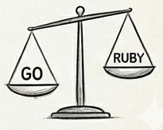

### Chapter 14 - Language Comparison



## Introduction

The Ruby language is an interpreted, object-oriented language that was designed with software developers in mind. Its interpreted nature allows you to run code in an interactive console as well as make changes to a file while in development and see those changes instantly. It has a rich collection of libraries, or 'gems' available which provide additional functionality beyond the standard library. Rails and other frameworks provide additional functionality.

The Go language is a compiled language designed around simplicity and performance. It's compiled to platform-specific machine code that is optmized for high performance and low latency for network-enabled applications. It also has a rich collection of libraries, or 'packages' that provide additional functionality.

In this chapter, we'll focus on the similarities and differences in the core or standard libraries for each language as well as dependency management to add features.

## Data Structures

Data structures are the way your app organizes and manages data. Each language provides built in structures that can be implemented depending on the requirements of the app.

### Ruby

#### Arrays

Arrays in Ruby are managed by the language, with features such as automatically resizing the array when items are added or deleted. In the example below we'll collect various fruits, access a couple of them and delete one of them from the array.

Example

```ruby
fruits = []
fruits << "apple"
fruits << "banana"
fruits << "blueberry"
fruits
=> ["apple", "banana", "blueberry"]

fruits.size
=> 3

fruits[0]
=> "apple"

fruits[1]
=> "banana"

fruits.delete("banana") # returns the deleted element
=> "banana"

fruits
=> ["apple", "blueberry"]

fruits.size
=> 2
```

##### Queue

The Ruby array object has a few built in methods to make it easy to implement a first-in-first-out queue where items that were added can be removed in the same order they were added.

Example

```ruby
queue = []
=> []

queue.unshift(:a)
=> [:a]

queue.unshift(:b)
=> [:b, :a]

queue.unshift(:c)
=> [:c, :b, :a]

queue.pop
=> :a

queue.pop
=> :b

queue.pop
=> :c
```

##### Stack

The Ruby array object has a few built in methods to make it easy to implement a first-in-last-out queue where items that were added can be removed in reverse order in which they were added.

Example

```ruby
queue.pop
=> nil

stack = []
=> []

stack.push(:a)
=> [:a]

stack.push(:b)
=> [:a, :b]

stack.push(:c)
=> [:a, :b, :c]

stack.pop
=> :c

stack.pop
=> :b

stack.pop
=> :a
```

#### Hash

Hashes are key/value structures where the keys can be anything. In the example below we'll use a hash to track the number of each fruit that we have on hand.

Example

```ruby
fruits = {}
fruits[:apple] = 2
fruits[:banana] = 1
fruits[:blueberry] = 5
fruits
=> {:apple => 2, :banana => 1, :blueberry => 5}

fruits.size
=> 3

fruits[:apple]
=> 2

fruits[:banana]
=> 1

fruits.delete(:banana) # returns the value of the key/value pair
=> 1

fruits
=> {:apple=>2, :blueberry=>2}

fruits.size
=> 2
```

## Concurrency

## Loops

## Control Expressions

## Dependency Management

## References

* https://go.dev/talks/2012/splash.article
* https://www.rubyguides.com/2019/04/ruby-data-structures
* https://objectcomputing.com/resources/publications/sett/november-2018-way-to-go-part-1

## Wrap Up

